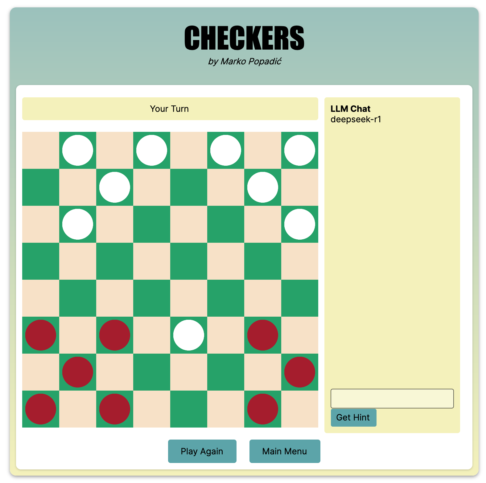

# CHECKERS BOT

[](https://github.com/markovolimango/Checkers/actions/workflows/build-and-test.yml)

*Project created for a task for JetBrains Internship Projects 2025 3.0*

## Features

- Bot Player: Play against the bot and choose how much time it has to think.
- Full GUI: See the board clearly and configure settings.
- LLM Hints: Connect to a local LLM you have installed with Ollama and ask it for hints.



## How to Run

1. Make sure you have .NET 8.0.0 or later installed.
2. Clone the repository
```zsh
git clone https://github.com/markovolimango/Checkers-Bot.git
```
3. Build the project
```zsh
cd Checkers
dotnet build
```
4. Run the app
```zsh
dotnet run --project Checkers
```

## Using LLM Hints

- Just turn them on in the settings and enter the name of a model that you already have isntalled with ollama.
- **Warning** LLMs are not good at checkers. At all. Do not take these hints seriously, but feel free to chat with the LLM and ask your own checkers related questions
